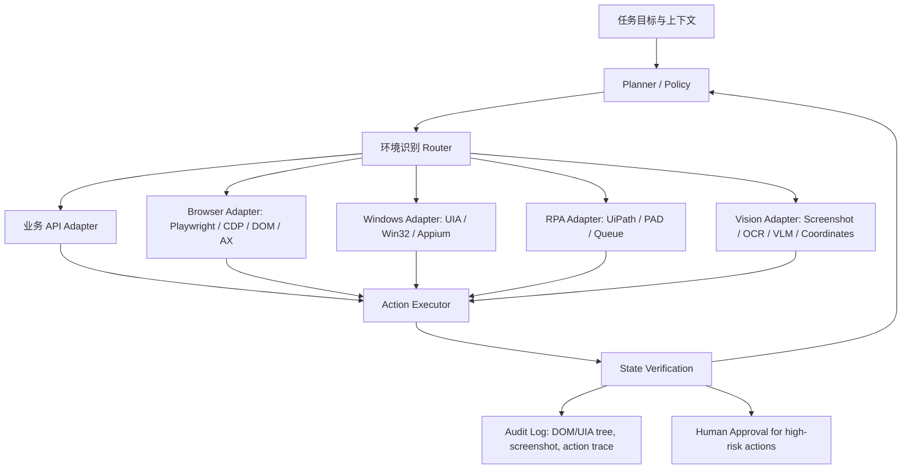

# OpenClaw / Hermes 类 Agent 操作软件任务的技术方案调研报告

日期：2026-06-06  
范围：这里的 “OpenClaw / Hermes 类 Agent” 指可以代表用户打开网页、操作桌面软件、点击按钮、填写表单、上传文件、提交流程的通用 Agent 运行时。上一版误写为 OpenCloud；本版已修正为 OpenClaw，并补充 Hermes 官方仓库公开文档里的浏览器执行方式。本报告仍以工程实现为主，不假设 OpenClaw 或 Hermes 已经内置完整 Windows 桌面软件自动化能力，而是区分 Web Agent、Computer Use、RPA、Windows UIA 与视觉坐标方案。

## 1. 核心结论

如果目标是让 Agent 稳定操作标书软件、政采平台、企业后台、办公软件等人机界面，不能只问“用 CDP 还是 DOM 树”。更准确的分层是：

1. 观察层：Agent 用什么方式理解当前界面。常见有 DOM、Accessibility Tree、浏览器截图、Windows UI Automation 树、OCR、视觉模型、业务 API、网络请求。
2. 动作层：Agent 用什么方式执行动作。常见有 JS `element.click()`、CDP 输入事件、Playwright/Selenium 动作、Windows UIA 控件模式、OS 级鼠标键盘、RPA 封装、VNC/RDP 输入事件。
3. 验证层：动作之后如何判断成功。常见有 DOM 断言、URL/网络请求断言、UIA 状态断言、截图/OCR 断言、业务数据回查、人工确认。

工程上最可靠的顺序是：

1. 有业务 API、导入导出接口、数据库、COM/OLE、命令行接口时，优先走结构化接口。
2. Web 系统优先用 Playwright/CDP/Selenium，通过 DOM、ARIA、Accessibility Tree、网络请求和文件上传能力做确定性自动化。
3. Windows 桌面软件优先用 UI Automation，也就是控件树和控件模式，而不是坐标点击。
4. 如果界面是自绘控件、Canvas、远程桌面、Citrix、虚拟机画面，才主要依赖截图、OCR、图像匹配和视觉模型。
5. AI Computer Use，也就是“看截图再输出坐标点击”，适合作为兜底、探索、低频任务助手，不适合作为高频、强合规、强确定性的唯一执行层。

一句话判断：CDP 和 DOM 不是同一级别的替代关系。DOM 是网页内部的数据结构，CDP 是控制浏览器的协议。CDP 可以读取 DOM，也可以截图、监听网络、派发鼠标事件、输入键盘、拿 Accessibility Tree。

## 2. 技术谱系总览

| 技术路线 | 主要目标 | Agent 看到什么 | Agent 怎么点 | 成熟度 | 适合场景 | 主要风险 |
|---|---|---|---|---|---|---|
| 业务 API/SDK/数据库/导入导出 | Web 与桌面业务系统 | 结构化数据 | API 调用 | 很高 | 批量填报、导入、审批、文档生成 | 需要接口权限和业务理解 |
| 浏览器 DOM/JS | Web 页面 | DOM 节点、表单、文本、属性 | `click()`、`dispatchEvent()`、设置 value | 高 | 内部 Web 系统、表单、后台 | 选择器变化、前端框架、用户手势限制 |
| CDP | Chromium 浏览器 | DOM、AX Tree、网络、截图、性能事件 | `Input.dispatchMouseEvent`、Runtime JS、文件上传 | 高 | Chrome/Edge 自动化、登录态浏览器、网页 Agent | Chromium 绑定、反自动化检测 |
| Playwright/Puppeteer | Web 页面 | Locator、DOM、AX、截图、网络 | locator click、keyboard、mouse、file upload | 很高 | Web E2E、Agent 浏览器执行器 | 对桌面软件无效 |
| Selenium/WebDriver/BiDi | 多浏览器 Web | DOM、浏览器协议对象 | WebDriver Actions | 很高 | 跨浏览器测试、企业自动化 | 低层能力不如 CDP 灵活，BiDi 仍在演进 |
| 浏览器扩展/Content Script | 用户真实浏览器页面 | DOM、页面事件、扩展 API | content script 注入、消息通信 | 中高 | 需要携带用户浏览器登录态、企业插件 | 跨域 iframe、权限、MV3 限制 |
| Windows UI Automation | Windows 桌面软件 | 控件树、Name、AutomationId、ControlType、Pattern | Invoke、Value、Selection、Scroll 等控件模式 | 高，取决于软件是否暴露控件 | WPF、WinForms、WinUI、标准控件软件 | 自绘控件、权限、控件信息缺失 |
| Win32 消息/控件句柄 | Windows 传统软件 | HWND、窗口层级、类名 | SendMessage、PostMessage、ControlClick | 中 | 老式 Win32 程序、简单按钮输入 | 现代 UI、自绘、跨权限、焦点问题 |
| OS 级鼠标键盘 | 任意可见界面 | 屏幕坐标 | SendInput、PyAutoGUI、AutoHotkey、CGEvent、xdotool | 中 | 兜底、临时脚本、跨软件点击 | 分辨率、DPI、焦点、窗口遮挡、不可后台 |
| 图像识别/OCR/视觉模型 | 任意屏幕画面 | 截图、文本识别、视觉 grounding | 坐标点击、拖拽、输入 | 中 | 远程桌面、Citrix、Canvas、自绘软件 | 慢、成本高、误点、需状态验证 |
| 企业 RPA | Web、桌面、远程桌面 | Selector、UIA、图像、OCR、流程状态 | 平台动作封装 | 高 | 稳定流程、合规审计、机器人调度 | 授权成本、流程维护、平台绑定 |
| AI Computer Use | 任意图形界面 | 截图 + 模型推理 | 点击坐标、滚动、输入、按键 | 中低到中，仍快速发展 | 无 API、未知界面、探索性任务 | 不确定性、误操作、安全、成本 |

## 3. “操作鼠标”具体有哪几种

### 3.1 JS 层点击，不是真鼠标

典型方式：

```js
document.querySelector("button.submit").click()
```

或者构造事件：

```js
el.dispatchEvent(new MouseEvent("click", { bubbles: true }))
```

优点是快、精确、可后台执行，可以直接对 DOM 元素下手。缺点是很多网站会区分真实用户事件和脚本事件，`dispatchEvent` 生成的事件通常不是可信用户手势；上传、剪贴板、支付、弹窗等场景可能失败。还有些前端框架只监听 pointer/mouse/keyboard 的完整序列，单纯 `click()` 不够。

适合：内部页面、普通按钮、展开折叠、读取隐藏 DOM、批量填普通表单。  
不适合：文件对话框、拖拽、需要真实用户手势的安全敏感动作。

### 3.2 浏览器协议级鼠标事件

CDP 的 `Input.dispatchMouseEvent` 可以向 Chromium 派发 `mousePressed`、`mouseReleased`、`mouseMoved` 等事件。Playwright、Puppeteer 和 Selenium 的高级点击最终也会走类似浏览器输入通道，只是它们封装了元素定位、滚动到视口、可点击性检查、重试、等待等工作。

优点是更接近真实用户操作，可以触发浏览器认为的交互行为，也能处理 hover、drag、canvas、坐标区域。缺点是要先获得元素位置或坐标，页面布局变化后需要重新计算。

适合：Web 页面的按钮、菜单、拖拽、Canvas 内点击、需要真实 pointer 事件的交互。  
不适合：非浏览器桌面软件。

### 3.3 WebDriver Actions

Selenium/WebDriver Actions 是 W3C 标准化的输入动作模型，可以表达鼠标移动、按下、释放、键盘组合等。WebDriver BiDi 则让浏览器控制从传统请求响应模型走向双向事件模型，能力正在接近 CDP，但目标是跨浏览器标准化。

优点是标准、跨浏览器、企业测试生态成熟。缺点是低层调试和 Chromium 专有能力不如 CDP 灵活。

适合：企业跨浏览器测试、已有 Selenium 体系。  
不适合：只需要深度操控 Chrome/Edge 的复杂 Agent 场景。

### 3.4 Windows UIA 控件级动作

UI Automation 不是移动鼠标，而是调用控件暴露的语义动作。例如：

1. 按钮：InvokePattern.Invoke
2. 输入框：ValuePattern.SetValue 或 TextPattern
3. 下拉框：ExpandCollapsePattern、SelectionPattern
4. 复选框：TogglePattern
5. 列表和表格：SelectionItemPattern、GridPattern、TablePattern
6. 滚动区域：ScrollPattern

这比坐标点击更稳定，因为动作绑定到控件语义，而不是屏幕位置。

适合：WPF、WinForms、WinUI、标准 Windows 控件、暴露了 AutomationId 的行业软件。  
不适合：自绘控件、游戏引擎界面、远程桌面图像、控件树缺失的软件。

### 3.5 Win32 消息和控件句柄

传统 Windows 自动化可以通过窗口句柄、控件类名、窗口标题定位控件，然后发送消息或使用 AutoHotkey 的 `ControlClick`、`ControlSend`。这类方式在老式 Win32 程序里很有效，甚至可以在窗口不完全置顶时操作某些控件。

优点是轻量、速度快、脚本生态成熟。缺点是对现代 UI、自绘控件、浏览器内嵌控件、跨权限窗口不稳定。

适合：老式 Windows 客户端、固定窗口、简单按钮输入。  
不适合：复杂标书软件里大量自绘表格、嵌入浏览器、Office/WPS 组件。

### 3.6 OS 级真实鼠标键盘

这类方式直接对操作系统注入输入事件，例如 Windows `SendInput`、macOS CGEvent、Linux xdotool、PyAutoGUI、AutoHotkey 的 `MouseClick`/`SendInput`。AI Computer Use 在宿主环境执行动作时，本质上也经常落到这一层，或者落到 VNC/RDP 的 framebuffer 输入事件。

优点是普适，几乎什么可见界面都能点。缺点是最脆弱：窗口必须在正确位置、分辨率和缩放一致、焦点正确、不能被遮挡，误点风险高。

适合：兜底、短流程、临时自动化、视觉模型点击。  
不适合：高频批量、后台运行、强合规提交。

### 3.7 图像识别和视觉 grounding 点击

SikuliX、PyAutoGUI 的 `locateOnScreen`、OpenCV 模板匹配、OCR、UiPath Computer Vision、现代 VLM grounding 都属于这一类。Agent 先看截图，找到“提交”“下一步”“选择文件”等视觉目标，再返回坐标点击。

优点是跨技术栈，面对远程桌面、Citrix、自绘控件、Canvas、视频流时也能工作。缺点是慢、误识别、主题变化和 DPI 变化会影响结果，需要强状态验证和人工确认。

适合：无控件树的软件、远程桌面、政府采购网站的验证码前后人工协同、遗留系统。  
不适合：需要 100% 确定性和无人值守提交的关键动作。

## 4. CDP、DOM、Accessibility Tree 的关系

### 4.1 DOM 是页面结构，不是控制协议

DOM 是网页运行时的对象树，包括标签、属性、文本、表单值、事件监听关系。Agent 可以用 CSS selector、XPath、JS 遍历 DOM 找到按钮、输入框、表格、隐藏字段。

DOM 的优点是信息密度高、可直接读写、比截图便宜。缺点是它不是用户最终看到的全部东西：Canvas、图片里的文字、视频、Shadow DOM、跨域 iframe、前端虚拟列表都可能让 DOM 观察变复杂。

### 4.2 CDP 是 Chromium 控制面

Chrome DevTools Protocol 是 Chrome/Edge/Chromium 的远程调试协议。常用域包括：

1. DOM：读取节点、查询元素、取 box model。
2. Runtime：执行 JS，读取页面变量，调用函数。
3. Input：派发鼠标、键盘、触摸事件。
4. Page：导航、截图、下载、生命周期事件。
5. Network：监听请求、响应、接口数据、文件下载。
6. Accessibility：读取可访问性树。
7. Target：管理 tab、iframe、worker。

所以 CDP 不是 DOM 的替代品，而是“可以访问 DOM、截图、网络和输入系统的底层通道”。

### 4.3 Accessibility Tree 更接近用户语义

Accessibility Tree 是浏览器或操作系统为屏幕阅读器等辅助技术暴露的语义树。它通常包含 role、name、value、checked、expanded、disabled 等语义。Playwright 的 `getByRole` 和很多 Agent 浏览器抽象都偏好这类语义信息。

优点是比 CSS class 更稳定，也更接近“点击名为提交的按钮”。缺点是很多页面可访问性做得差，按钮没有名字、图标无 label、表格语义缺失时效果会下降。

## 5. 浏览器 Agent 的成熟方案

### 5.1 Playwright

Playwright 是目前最适合做 Web Agent 执行器的基础库之一。它提供 locator、auto-waiting、actionability check、文件上传、网络监听、截图、trace、跨浏览器、并发上下文等能力。对工程团队来说，它比直接写 CDP 更可维护。

优势：

1. Locator 抽象比裸 CSS selector 稳定，支持 role、text、label、test id。
2. 点击前会检查可见、稳定、可接收事件、启用状态。
3. 网络、下载、上传、弹窗、iframe、Shadow DOM 支持成熟。
4. Trace 和截图便于审计 Agent 每一步做了什么。

劣势：

1. 主要面向浏览器，不能操作普通桌面软件。
2. 对强反自动化网站仍可能被识别。
3. 如果页面本身可访问性很差，仍需要 fallback 到坐标或 DOM hack。

建议：OpenClaw / Hermes 类 Web Agent 的第一选择应是 Playwright/CDP 加 DOM/AX/screenshot 混合观察，而不是纯视觉点击。

### 5.2 Puppeteer 和原始 CDP

Puppeteer 与 CDP 结合更紧，适合 Chrome/Chromium 深度自动化。原始 CDP 更适合做底层平台能力，比如连接用户现有 Chrome、读取所有 target、注入脚本、统一截图、监听网络。

优势：

1. 能直接使用 Chromium 专有能力。
2. 可以非常细粒度地控制输入、网络、调试、性能。
3. 适合构建自己的 browser automation proxy。

劣势：

1. 原始 CDP API 复杂，工程维护成本高。
2. Chrome/Edge 绑定更强。
3. 缺少 Playwright 那样的高层等待和可点击性封装时，脚本更容易脆。

建议：平台层可以用 CDP，业务自动化层尽量封装成 locator/action/assertion。

### 5.3 Selenium WebDriver 和 WebDriver BiDi

Selenium 是企业测试自动化的老牌方案，优势是标准、生态、跨浏览器和企业接受度。WebDriver BiDi 是新一代双向协议，目标是弥合传统 WebDriver 与 CDP 在事件监听、网络、日志、调试能力上的差距。

优势：

1. 跨浏览器标准化。
2. 企业测试团队熟悉。
3. 已有大量 Grid、CI、报告、测试资产。

劣势：

1. 深度 Chrome 自动化能力不如直接 CDP 方便。
2. 对 Agent 来说，高频“观察、决策、再行动”的闭环需要额外封装。

建议：如果团队已有 Selenium 资产，可以继续使用；新建 Agent 执行器更建议 Playwright 或 CDP proxy。

### 5.4 Browser-use、Stagehand、Browserbase、Chrome DevTools MCP

这些属于更 Agent 化的浏览器自动化层。它们通常把网页观察、动作、提取、LLM 调用封装成更高层接口。

典型思路：

1. 浏览器运行在本地或云端 sandbox。
2. Agent 获取 DOM/AX/截图的压缩表示。
3. 模型决定下一步动作。
4. 执行器用 Playwright/CDP 点击、输入、提取。
5. 对复杂页面提供 observe、act、extract 等抽象。

优势是上手快、Agent 友好。劣势是可控性和可审计性取决于平台封装，复杂企业流程最终仍需要工程化的确定性动作和状态断言。

### 5.5 OpenClaw 与 Hermes 的公开实现特征

OpenClaw 官方文档里的 Browser 工具是典型的“托管 Chromium + CDP/Chrome DevTools MCP + snapshot/screenshot/action”路线。它可以启动隔离的 `openclaw` 浏览器 profile，也可以通过 `user` profile 附着到用户真实登录的 Chrome 会话；工具能力包括 tab 控制、click/type/drag/select、snapshot、screenshot、PDF，并支持本地、远程 CDP、Browserless 等模式。它还把截图视觉理解作为文本模型的补充能力。这说明 OpenClaw 的 Web 自动化主干不是单纯“看图点坐标”，而是 Chromium 控制面加结构化 snapshot，再用截图兜底。

Hermes Agent 官方仓库的浏览器文档更直接：页面被表示为 accessibility tree 的 text snapshot，交互元素有 `@e1`、`@e2` 这类 ref id，`browser_click` 和 `browser_type` 用这些 ref id 操作元素。它支持 Browserbase、Browser Use、Firecrawl、Camofox、本地 Chromium CDP、本地 `agent-browser` 等后端；还提供 `browser_vision` 截图视觉分析、`browser_console` JS/console 能力，以及 `browser_cdp` 原始 CDP passthrough。Hermes 文档也明确其限制之一是 text-based interaction 依赖 accessibility tree，不是像素坐标。

因此，如果问题限定在 OpenClaw/Hermes 的“浏览器 Agent”部分，上一版报告的判断基本正确：它们主要是 Accessibility Tree / snapshot / CDP / 浏览器后端 / 截图视觉的混合路线，而不是传统 Windows RPA。但如果目标是“标书软件客户端”这种非浏览器 Windows 软件，则不能只看 OpenClaw/Hermes 的浏览器工具能力，还必须引入 Windows UIA、RPA 或 Computer Use 视觉坐标执行层。

## 6. Windows 桌面软件的成熟方案

### 6.1 Windows UI Automation

对标书软件、投标客户端、行业客户端，第一步应先判断它是否暴露 UIA 控件树。工具包括 Microsoft Inspect、Accessibility Insights for Windows、FlaUInspect、pywinauto 的 inspect 工具等。

如果能看到稳定的 AutomationId、Name、ControlType、BoundingRectangle 和 Pattern，那么可以构建比较稳定的 Agent adapter：

1. Snapshot：枚举当前窗口 UIA tree，提取可操作控件。
2. Grounding：按 AutomationId、Name、ControlType、路径定位控件。
3. Action：调用 Invoke、Value、Toggle、Selection、Scroll 等 Pattern。
4. Assertion：读取控件状态、窗口标题、提示文本、表格内容。

优势：

1. 比坐标稳定。
2. 可后台读取语义状态。
3. 适合确定性脚本和可审计流程。

劣势：

1. 软件必须暴露控件信息。
2. 自绘控件可能只有一个大面板，内部按钮不可见。
3. 跨权限操作有问题，例如自动化进程权限低于目标软件。
4. 有些控件 Name 动态变化，路径定位需要维护。

推荐库：

1. Python：pywinauto，适合快速脚本和 PoC。
2. .NET：FlaUI，适合 Windows 原生工程化。
3. Appium Windows Driver：适合已有 Appium/Selenium 风格体系。
4. WinAppDriver：历史上常用，但维护活跃度需要谨慎评估。

### 6.2 Win32/AutoHotkey

AutoHotkey 在 Windows 桌面自动化里仍然实用，特别是固定窗口和简单流程。它可以做热键、窗口激活、控件点击、图像搜索、剪贴板自动化。

适合场景：

1. 临时替代人工重复操作。
2. 固定分辨率和窗口布局。
3. 老式 Win32 控件。
4. 与人工协同的半自动流程。

不建议把它作为复杂标书流程的唯一底座，因为它很容易受焦点、窗口位置、DPI、弹窗影响。

### 6.3 PyAutoGUI、SikuliX、OpenCV

这类方案以屏幕图像为中心。SikuliX 用截图模板定位 UI 元素；PyAutoGUI 可以截图、图像匹配、鼠标键盘操作；OpenCV 可以做更复杂的模板匹配和视觉识别。

优势：

1. 对任何可见界面都可用。
2. 对远程桌面、自绘软件、Canvas 友好。
3. 可以快速实现“看到某图标就点击”。

劣势：

1. 维护成本高，界面主题或缩放变了就可能失败。
2. 误点风险高。
3. 批量无人值守时必须有强校验。

建议：把视觉方案作为 fallback，而不是第一层。

### 6.4 企业 RPA

UiPath、Microsoft Power Automate Desktop、Automation Anywhere、Blue Prism 等 RPA 平台已经在企业流程自动化里很成熟。它们不是单一技术，而是把 selector、UIA、图像、OCR、流程编排、凭据、队列、监控、审计、人机协同封装在一起。

优势：

1. 有录制器、流程设计器、异常处理、重试、审计。
2. 适合财务、人事、投标、政采、ERP、Excel、邮件等流程。
3. 可以做 attended 和 unattended bot。
4. 适合企业合规和运维。

劣势：

1. 商业授权和平台绑定。
2. 复杂流程仍需要专业 RPA 开发维护。
3. AI Agent 与 RPA 平台结合时，需要明确边界，避免模型直接做高风险动作。

建议：如果标书流程是高频、固定、强审计，RPA 平台成熟度高于纯 AI Agent；如果流程变化大、需要理解页面和文档，Agent 可以负责规划和异常处理，RPA 负责确定性执行。

## 7. AI Computer Use 方案

OpenAI、Anthropic、Google 等都在提供或实验 “Computer Use” 类能力。共同模式是：

1. 宿主环境给模型一张截图。
2. 模型根据任务判断下一步。
3. 模型输出动作，例如 click、double click、scroll、type、keypress、drag、wait。
4. 宿主执行动作。
5. 再截图，进入下一轮。

这类能力的价值是“通用”。它不要求目标软件有 DOM 或 UIA，可以像人一样看屏幕操作。缺点也是“通用”带来的不确定性：它可能看错按钮、忽略弹窗、被页面里的恶意提示影响、在关键步骤误提交。

适合：

1. 低频、人工可监督任务。
2. 未知界面探索。
3. 没有 API、DOM、UIA 的遗留系统。
4. 作为 UIA/CDP 自动化失败后的兜底。

不适合单独承担：

1. 金额、投标、法律提交、删除、付款等高风险动作。
2. 大规模无人值守批处理。
3. 必须可复现、可审计、可解释的流程。

工程建议：把 Computer Use 当成“视觉推理和异常处理层”，不要把它当成唯一执行器。成功跑通的路径应该沉淀成 Playwright/UIA/RPA 的确定性脚本。

## 8. 针对标书软件和投标流程的落地路径

标书软件可能有多种形态，因此要先分型。

### 8.1 Web 政采/招投标平台

如果是浏览器里的政采平台、供应商后台、电子招投标系统：

优先路线：

1. Playwright 或 CDP 连接浏览器。
2. 用 DOM 和 Accessibility Tree 定位菜单、按钮、表单、表格。
3. 监听 Network，识别真实业务接口。
4. 文件上传使用 `setInputFiles` 或 CDP 文件上传能力，避免手点系统文件对话框。
5. 对每一步做 URL、DOM 文本、接口响应、截图四类断言。
6. 提交、撤回、报价、盖章、支付等关键动作前必须人工确认。

常见问题：

1. 登录态、CA 锁、验证码、短信验证、UKey 签章。
2. 多 iframe、ActiveX/插件、嵌入 PDF/Office 控件。
3. 页面可访问性差，按钮只有图标。
4. 反自动化检测。

建议：

1. 普通浏览、填表、上传附件可以自动化。
2. CA 签章、最终提交、报价确认建议 human-in-the-loop。
3. 如果真实业务接口可被合法调用，接口优先于 UI。

### 8.2 Windows 原生标书客户端

如果是安装在 Windows 上的投标客户端：

优先路线：

1. 用 Inspect 或 FlaUInspect 查看 UIA 树。
2. 如果控件信息完整，用 UIA/FlaUI/pywinauto 做操作。
3. 如果软件是 Electron/CEF 内嵌浏览器，尝试启用 remote debugging，用 CDP 操作内嵌 Web 页面。
4. 如果主区域是自绘控件或 PDF/Office 控件，用 OCR/图像识别辅助。
5. 对文件生成、文档合并、PDF 检查、目录提取等环节，尽量用文档 API，而不是在 GUI 里点。

推荐验证：

1. 每次点击前确认当前窗口标题和关键文本。
2. 每次输入后读取控件值或 OCR 回读。
3. 上传后检查附件列表、文件名、大小。
4. 提交前生成完整截图和操作日志。
5. 对不可逆动作强制人工确认。

### 8.3 远程桌面、Citrix、虚拟机里的软件

这种环境通常拿不到 DOM 或 UIA，只能看到远程画面。技术路线：

1. VNC/RDP 截图。
2. OCR 识别文字。
3. 图像模板或 VLM grounding 定位按钮。
4. 注入远程鼠标键盘事件。
5. 严格用截图/OCR 验证结果。

成熟度比本地 Web/UIA 低，但在无法进入系统内部时是唯一可行路线。

## 9. 推荐的 OpenClaw / Hermes 类 Agent 架构

建议做成分层混合执行器，而不是单一“鼠标点击器”。



### 9.1 Router 判断逻辑

1. 目标是否有 API 或文件接口：有则 API 优先。
2. 是否是浏览器页面：是则 Playwright/CDP。
3. 是否是 Electron/CEF：尝试 CDP，失败再 UIA/视觉。
4. 是否是标准 Windows 桌面控件：UIA 优先。
5. 是否是远程桌面或自绘画面：视觉/OCR。
6. 是否是稳定企业流程：考虑 RPA 平台承接。

### 9.2 动作不要只记录坐标

一次动作日志应记录：

1. 目标描述：例如“点击 附件上传 按钮”。
2. 目标定位：DOM selector、role/name、UIA AutomationId、OCR 文本位置、模板名称。
3. 执行动作：click、invoke、set value、upload file。
4. 前置状态：URL、窗口标题、关键控件、截图 hash。
5. 后置断言：出现“上传成功”、附件列表包含文件、接口返回成功。
6. 风险等级：普通、可撤销、不可逆、需人工确认。

这样失败后才知道是定位错、页面变了、权限错，还是业务规则变了。

## 10. 成熟度判断

| 场景 | 推荐成熟方案 | 成熟度 | 备注 |
|---|---|---|---|
| 普通 Web 后台 | Playwright/CDP | 很成熟 | 工程可控，适合长期维护 |
| 多浏览器测试 | Selenium/WebDriver | 很成熟 | 企业生态强 |
| Chrome 深度自动化 | CDP/Puppeteer | 成熟 | 底层灵活，但封装成本高 |
| 用户真实浏览器登录态 | CDP proxy/浏览器扩展 | 成熟 | 注意权限和账号安全 |
| 标准 Windows 客户端 | UIA/FlaUI/pywinauto | 成熟到中等 | 取决于软件 UIA 暴露质量 |
| 老式 Win32 程序 | AutoHotkey/Win32 message | 中等 | 简单流程有效 |
| 远程桌面/Citrix | 视觉/OCR/RPA CV | 中等 | 需要强验证和人工兜底 |
| 大企业固定流程 | UiPath/PAD/Automation Anywhere | 成熟 | 授权和维护成本较高 |
| 任意软件通用 AI 操作 | OpenAI/Anthropic/Gemini Computer Use | 发展中 | 适合探索和兜底，不宜单独无人值守 |

## 11. 优劣势对比

### CDP/Playwright

优点：

1. 对 Web 最强。
2. 可同时看 DOM、AX、网络、截图。
3. 可以文件上传、下载、拦截请求。
4. 可审计性好。

缺点：

1. 只能管浏览器或内嵌 Chromium。
2. 对非浏览器软件无效。
3. 可能触发网站自动化检测。

### DOM 操作

优点：

1. 快、便宜、结构化。
2. 能读隐藏数据和表单状态。
3. 可直接填值和提取数据。

缺点：

1. 不等于真实用户操作。
2. 前端改版后选择器易失效。
3. Canvas、图片、远程桌面无效。

### UIA

优点：

1. Windows 桌面软件的语义自动化主力。
2. 比坐标稳定。
3. 可以做控件状态断言。

缺点：

1. 依赖软件可访问性实现。
2. 自绘控件常常不可见。
3. 跨权限和弹窗处理复杂。

### 坐标/视觉

优点：

1. 最通用。
2. 适合无结构化接口的界面。
3. 能处理远程画面。

缺点：

1. 最不稳定。
2. 误操作风险高。
3. 难以后台运行和批量扩展。

### 企业 RPA

优点：

1. 流程编排、审计、调度成熟。
2. 对业务团队友好。
3. 有凭据、队列、异常处理、人工协同。

缺点：

1. 成本和平台绑定。
2. 流程变化仍需要维护。
3. AI 能力通常要额外集成。

## 12. 安全与合规建议

Agent 操作软件不是普通脚本，风险来自账号权限、不可逆动作和界面误解。

建议强制实现：

1. 权限隔离：Agent 使用单独账号，不用个人超级账号。
2. 白名单：限制可访问网站、软件、目录和文件类型。
3. 人工确认：提交投标、报价、付款、删除、撤回、盖章、发送邮件必须确认。
4. 审计日志：保存每步动作、截图、输入、上传文件 hash、结果断言。
5. 敏感信息保护：不要把密码、证书 PIN、CA 口令直接暴露给模型。
6. Prompt injection 防护：页面文字、PDF、邮件内容都可能诱导 Agent 改变目标，必须把网页内容当成不可信输入。
7. 回滚策略：能撤销的动作才允许自动执行；不可撤销动作进入人工审批。

## 13. 推荐技术选型

如果现在要做 OpenClaw / Hermes 类 Agent 去操作标书软件，我建议分三期：

### 第一期：可行性审计和 PoC

目标是判断目标软件属于哪类。

1. Web 平台：Playwright 跑通登录后页面导航、填表、上传、状态读取。
2. Windows 客户端：用 Inspect/FlaUInspect 查看 UIA 树质量。
3. Electron/CEF 客户端：检查是否能打开 remote debugging port。
4. 自绘或远程桌面：采集截图，测试 OCR 和视觉定位。
5. 文档处理：标书 Word/PDF/Excel 尽量走文件解析和 Office/WPS 自动化接口，不走 GUI。

产出：目标系统能力画像、可自动化步骤清单、必须人工确认步骤清单。

### 第二期：确定性执行器

1. Web Adapter：Playwright/CDP，封装 `clickByRole`、`fillByLabel`、`uploadFile`、`waitForBusinessState`。
2. Windows Adapter：UIA/FlaUI 或 pywinauto，封装 `invokeControl`、`setValue`、`selectItem`、`readTable`。
3. Vision Adapter：OCR + 模板/VLM，仅用于无法结构化定位的区域。
4. Assertion Engine：每步都要有后置状态检查。
5. Audit Engine：统一截图、日志、结构化 action trace。

### 第三期：Agent 化和流程沉淀

1. 让 LLM 负责理解任务、选择流程、处理异常。
2. 成功路径沉淀成确定性技能，不让模型每次重新“看图猜”。
3. 高风险步骤接入人工审批。
4. 与 RPA 平台或队列系统集成，支持批量任务和失败重试。

## 14. 最终建议

对 OpenClaw / Hermes 这类 Agent，最合理的技术战略不是选择一种“鼠标方式”，而是做一个多后端执行器：

1. Web：Playwright/CDP 是主力。
2. 桌面：Windows UIA 是主力。
3. 企业流程：RPA 是成熟补充。
4. 任意界面：截图 + OCR/VLM + 坐标点击是兜底。
5. 高风险动作：人工确认是硬约束。

如果只用视觉坐标点击，短期 demo 会很快，但长期稳定性差。如果只用 DOM/CDP，又无法覆盖标书客户端这类桌面软件。真正可落地的方案应当是“API 优先、结构化 UI 次之、视觉兜底、全程断言和审计”。

## 15. 主要资料来源

浏览器与 Web 自动化：

1. OpenClaw Browser 工具：https://docs.openclaw.ai/tools/browser
2. Hermes Agent Browser Automation：https://github.com/NousResearch/hermes-agent/blob/main/website/docs/user-guide/features/browser.md
3. Chrome DevTools Protocol 总览：https://chromedevtools.github.io/devtools-protocol/
4. CDP DOM Domain：https://chromedevtools.github.io/devtools-protocol/tot/DOM/
5. CDP Input.dispatchMouseEvent：https://chromedevtools.github.io/devtools-protocol/tot/Input/#method-dispatchMouseEvent
6. CDP Accessibility Domain：https://chromedevtools.github.io/devtools-protocol/tot/Accessibility/
7. Playwright Locators：https://playwright.dev/docs/locators
8. Playwright Auto-waiting and actionability：https://playwright.dev/docs/actionability
9. Puppeteer 文档：https://pptr.dev/
10. Selenium WebDriver 文档：https://www.selenium.dev/documentation/webdriver/
11. Selenium WebDriver BiDi 文档：https://www.selenium.dev/documentation/webdriver/bidi/
12. W3C WebDriver：https://www.w3.org/TR/webdriver2/
13. W3C WebDriver BiDi：https://www.w3.org/TR/webdriver-bidi/
14. Chrome DevTools MCP：https://github.com/ChromeDevTools/chrome-devtools-mcp
15. browser-use：https://github.com/browser-use/browser-use
16. Stagehand：https://docs.stagehand.dev/

桌面自动化与 RPA：

1. Microsoft UI Automation Overview：https://learn.microsoft.com/en-us/windows/win32/winauto/uiauto-uiautomationoverview
2. Microsoft UI Automation Control Patterns：https://learn.microsoft.com/en-us/windows/win32/winauto/uiauto-controlpatternsoverview
3. Microsoft Inspect：https://learn.microsoft.com/en-us/windows/win32/winauto/inspect-objects
4. pywinauto：https://pywinauto.readthedocs.io/en/latest/
5. FlaUI：https://github.com/FlaUI/FlaUI
6. Appium Windows Driver：https://github.com/appium/appium-windows-driver
7. WinAppDriver：https://github.com/microsoft/WinAppDriver
8. Apple Accessibility API：https://developer.apple.com/documentation/applicationservices/accessibility-api
9. PyAutoGUI：https://pyautogui.readthedocs.io/en/latest/
10. SikuliX：https://sikulix.github.io/
11. AutoHotkey ControlClick：https://www.autohotkey.com/docs/v2/lib/ControlClick.htm
12. AutoHotkey ImageSearch：https://www.autohotkey.com/docs/v2/lib/ImageSearch.htm
13. Microsoft Power Automate desktop UI elements：https://learn.microsoft.com/en-us/power-automate/desktop-flows/ui-elements
14. UiPath selectors：https://docs.uipath.com/studio/standalone/latest/user-guide/about-selectors
15. UiPath Computer Vision activities：https://docs.uipath.com/activities/other/latest/ui-automation/computer-vision

AI Computer Use：

1. OpenAI Building agents: Computer use：https://developers.openai.com/tracks/building-agents#computer-use
2. OpenAI Cookbook: Computer Use Agents in Daytona Sandboxes：https://developers.openai.com/cookbook/examples/agents_sdk/computer_use_with_daytona/computer_use_with_daytona
3. Anthropic Computer use tool：https://docs.anthropic.com/en/docs/agents-and-tools/tool-use/computer-use-tool
4. Google Gemini Computer Use：https://ai.google.dev/gemini-api/docs/computer-use
5. OSWorld benchmark：https://arxiv.org/abs/2404.07972
